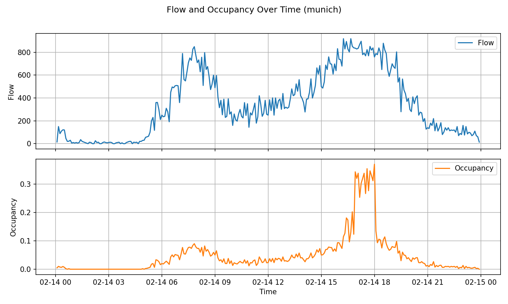
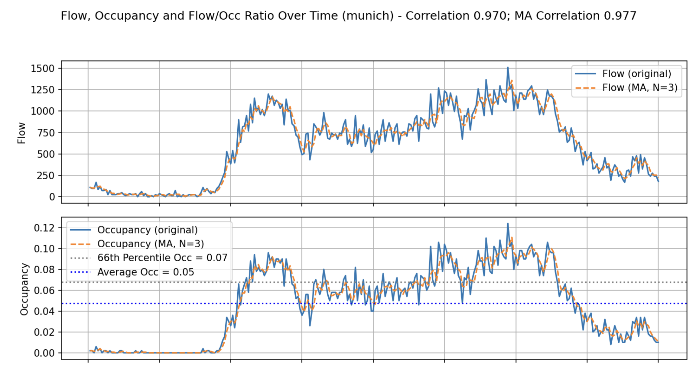
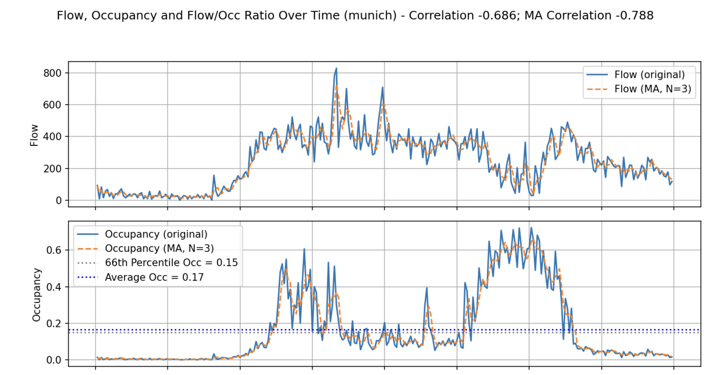

# Predicting Critical Roads with Traffic Jams

Authors: Dario Vajda, Oliver Majer, Diego Bonaca

University of Ljubljana

This repository contains materials for the project "Predicting Critical Roads with Traffic Jams". The goal is to train a model that identifies road segments most likely to cause traffic jams in large urban road networks. The model will combine graph topology, population density and traffic measurements and will be evaluated in an inductive setting (train on some cities, test on unseen cities).

## 1. Introduction

We aim to predict which road segments are critical (i.e., have high congestion probability) using graph-based machine learning. A reliable model could be used in planning and to detect potential issues before physical changes are made to the road network.

## 2. Data

2.1 City networks
- Source: OpenStreetMap (OSM) via the `OSMnx` Python library. OSMnx will be used to download and convert street networks into graph representations suitable for GNNs.

2.2 Population density
- Source: High Resolution Settlement Layer (HRSL) published as GeoTIFF rasters (∼30m×30m resolution). We will extract population estimates per spatial cell and map those to nearby road segments or nodes.

2.3 Traffic data
- Source: UTD19 dataset (ETH). UTD19 provides traffic flow information from thousands of stationary detectors and will serve as the ground truth for model training and evaluation.

Notes on preprocessing
- Convert HRSL GeoTIFFs to point or CSV formats (latitude, longitude, population) or resample onto the road graph. Use `rasterio` or GDAL for raster handling. Align spatial reference systems when joining population to graph nodes.

## 3. Model

Problem framing
- Binary classification on road segments: critical vs non-critical.
- Inductive evaluation: train on a set of cities and test on cities not seen during training.

Model family choices considered
- Graph Transformers — global self-attention can capture long-range dependencies but scale O(n^2) in memory and are impractical for very large city graphs.
- Message-Passing GNNs (MP-GNNs) — scale close to O(n) on sparse graphs and are more practical for large road networks.

Chosen approach
- We will use a message-passing GNN with local attention: Graph Attention Network (GAT). GAT combines expressivity (learnable attention weights over neighbors) with reasonable scaling on sparse road networks.

Implementation notes
- Node / edge features can include: topology features (degree, betweenness), sensor time-aggregates (average flow, peak counts), mapped population around the node/segment, road type and length.
- If temporal dynamics are important, extend GAT with temporal encoding (e.g., additional temporal features, temporal convolutions, or a temporal GNN variant).

## 4. Metrics and evaluation

Primary metrics
- Precision, recall and the F_2-score (β=2), where recall is emphasized because false negatives (missing a critical road) are costlier than false positives.

Secondary metrics
- ROC AUC, Recall@k%, Brier score, and Expected Calibration Error (ECE) for calibration analysis.

F_β formula
$$
F_{\beta} = (1 + \beta^2) \cdot \frac{P \cdot R}{\beta^2 P + R}
$$

Data splits & protocol
- Inductive split by city: 70% cities for training, 10% for validation and 20% for testing. Cities used for testing must be unseen during training and validation.
- Use validation to tune hyperparameters and select the classification threshold that maximizes F_2.

## 5. Experimental setup

- Train / val / test splits are per-city (not per-segment) to test generalization across urban networks.
- Use class weighting or oversampling if the critical class is rare.
- Provide per-city and aggregated metrics in results.

# Project Progress

Preparing content for the final Medium article.

### 1. Detecting Traffic Jams
See [`analyse_utd19`](analyse_utd19).

The UTD19 dataset contains the measurements from thousands of detectors in different cities around the world. Each detector gives us the *occupancy* and *flow* over time for one or multiple days. See the example below:

<figure>
    
    <figcaption>Figure 1 - Example graph of *occupancy* and *flow* during a single day.</figcaption>
</figure>

We detect traffic jams by looking at the **correlation** between the *occupancy* and *flow*. The assumption we make is that if no traffic jams occur, the traffic flow will be proportional (highly correlated) to the occupancy of the detectors. The opposite holds for detectors placed on roads which are prone to causing serious traffic jams.

To eliminate noise, we use the moving averages of the signals with sliding window of size 3. Another observation is that most of the signals are not particularly useful, because they are during the night or non peak hours. Therefore, we only consider the data where occupancy is in the 66th upper percentile.

```python
# Compute moving averages for flow and occ
df["flow_ma"] = df["flow"].rolling(window=N, min_periods=1).mean()
df["occ_ma"] = df["occ"].rolling(window=N, min_periods=1).mean()

# Compute the mask for the 66th percentile
valid_ma_mask = df["occ_ma"] > df["occ"].quantile(0.66)

# Calculate the correlation between flow and occupance
correlation_ma = df.loc[valid_ma_mask, ["flow_ma", "occ_ma"]].corr().iloc[0, 1]
```

By calculating the correlation between *occupancy* and *flow*, we get a confidence score indicating how likely it is that a traffic jam occured, where negative values indicate traffic jams. See the following two examples:

<figure>
    
    <figcaption>Figure 2 - Example where a traffic jam DID NOT occur.</figcaption>
</figure>

<figure>
    
    <figcaption>Figure 3 - Example where a traffic jam DID occur.</figcaption>
</figure>

2. Finding the Detectors on the map
The utd19_u.csv dataset contains detector records identified by detid. Additional geographic information (latitude and longitude) for each detector is provided in detectors_public.csv.
Using this geo data, detectors are mapped to their corresponding road segments (nodes). Each road segment is then enriched with two attributes. Namely, has_detector (boolean) — indicates whether the segment has one or more detectors and detectors (list) — contains the list of associated detector IDs.  

### 3. Mapping Population Density to the Graph
...
