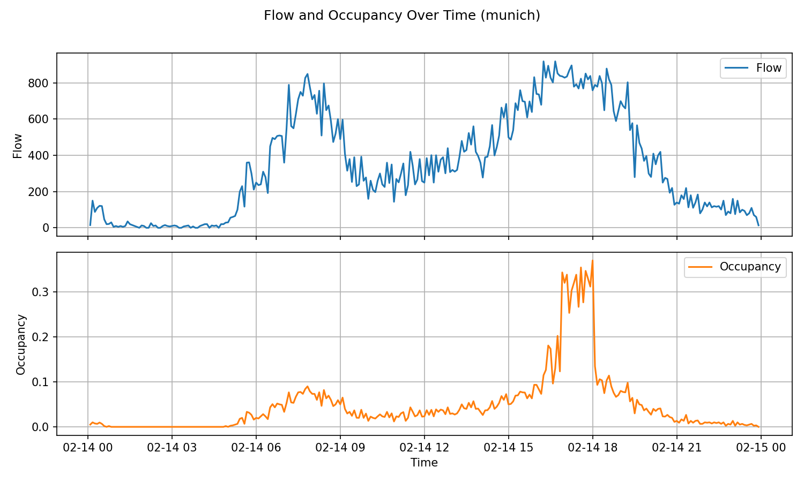
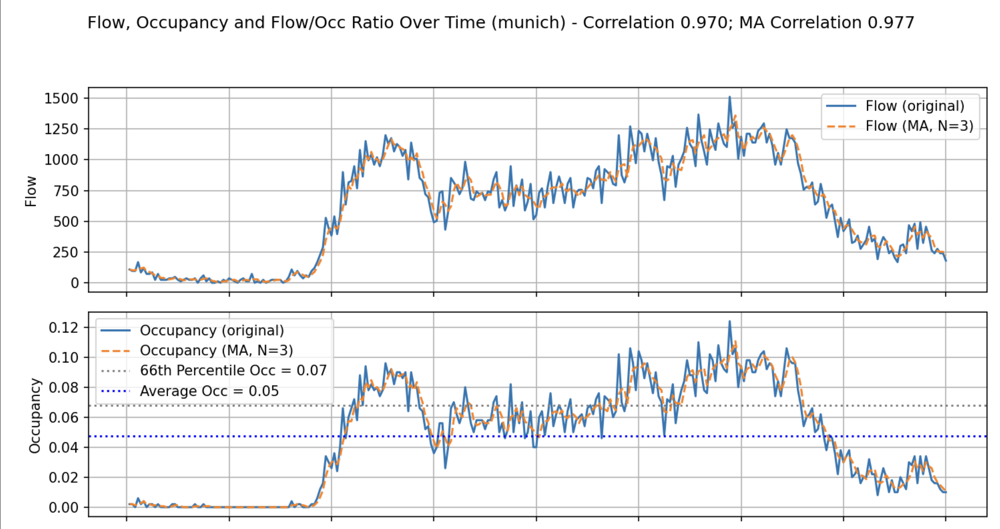
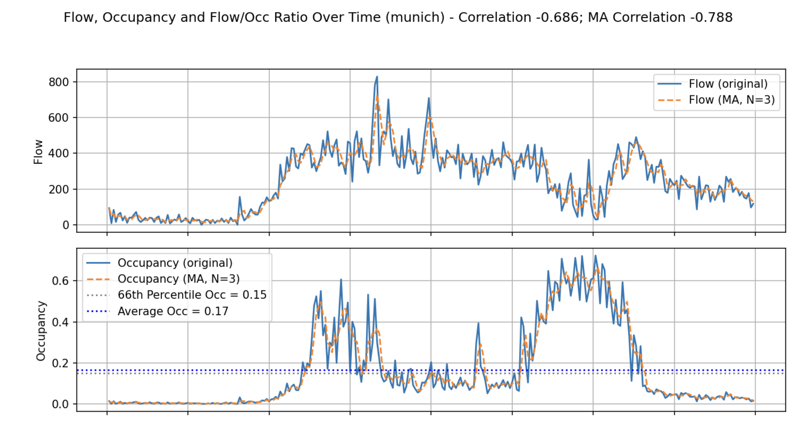

### 1. Detecting Traffic Jams

The UTD19 dataset contains the measurements from thousands of detectors in different cities around the world. Each detector gives us the *occupancy* and *flow* over time for one or multiple days. See the example below:

<figure>
    
    <figcaption>Figure 1 - Example graph of *occupancy* and *flow* during a single day.</figcaption>
</figure>

We detect traffic jams by looking at the **correlation** between the *occupancy* and *flow*. The assumption we make is that if no traffic jams occur, the traffic flow will be proportional (highly correlated) to the occupancy of the detectors. The opposite holds for detectors placed on roads which are prone to causing serious traffic jams.

To eliminate noise, we use the moving averages of the signals with sliding window of size 3. Another observation is that most of the signals are not particularly useful, because they are during the night or non peak hours. Therefore, we only consider the data where occupancy is in the 66th upper percentile.

```python
# Compute moving averages for flow and occ
df["flow_ma"] = df["flow"].rolling(window=N, min_periods=1).mean()
df["occ_ma"] = df["occ"].rolling(window=N, min_periods=1).mean()

# Compute the mask for the 66th percentile
valid_ma_mask = df["occ_ma"] > df["occ"].quantile(0.66)

# Calculate the correlation between flow and occupance
correlation_ma = df.loc[valid_ma_mask, ["flow_ma", "occ_ma"]].corr().iloc[0, 1]
```

By calculating the correlation between *occupancy* and *flow*, we get a confidence score indicating how likely it is that a traffic jam occured, where negative values indicate traffic jams. See the following two examples:

<figure>
    
    <figcaption>Figure 2 - Example where a traffic jam DID NOT occur.</figcaption>
</figure>
<br />
<figure>
    
    <figcaption>Figure 3 - Example where a traffic jam DID occur.</figcaption>
</figure>